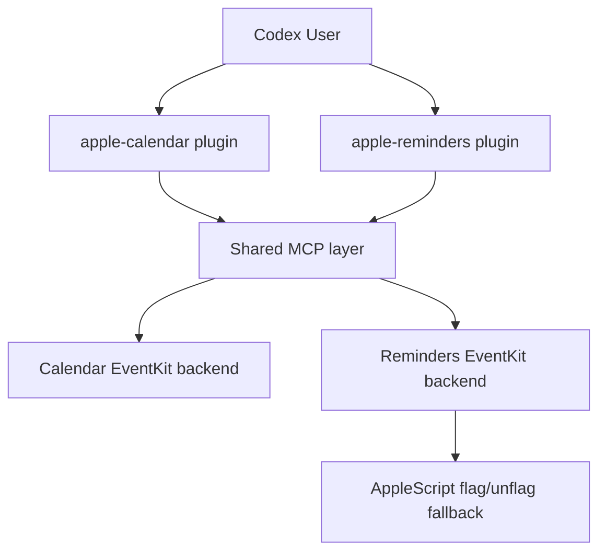

# Apple Productivity MCP

> Local Apple Calendar + Reminders tooling for macOS, with Codex plugin adapters and a shared MCP layer underneath.


## What This Repo Gives You

- native Apple Calendar automation
- native Apple Reminders automation
- installable Codex plugins for both
- one shared local MCP server
- recurring events and recurring reminders
- `.ics` export and import
- smoke tests for both CLI and MCP flows

## Architecture



## Repo Layout

```text
apple-productivity-mcp/
  plugins/
    apple-calendar/          # user-facing Codex plugin
    apple-reminders/         # user-facing Codex plugin
  mcp/
    apple-productivity/      # shared MCP server layer
      server/
  scripts/
    install_local_plugins.py
    smoke_test_apple_cli.py
    smoke_test_apple_mcp.py
  .agents/plugins/marketplace.json
  CHANGELOG.md
  LICENSE
  README.md
```

## What Is A Plugin vs What Is MCP?

### `plugins/`

These are the things you install and use directly in Codex.

- `apple-calendar`
- `apple-reminders`

They contain:

- plugin manifest
- skill docs
- CLI wrappers
- config
- `.mcp.json` wiring to the shared MCP server

### `mcp/`

This is infrastructure, not the user-facing plugin layer.

`mcp/apple-productivity/` contains the shared local stdio MCP server used by both plugins.

That separation keeps the repo cleaner:

- plugin UX stays in `plugins/`
- shared transport/integration logic stays in `mcp/`

## Choose Your Usage Mode

| Mode | Best for |
| --- | --- |
| Codex plugin skill | Natural chat-like usage in Codex |
| CLI wrapper | Scriptable local automation |
| MCP tools | Reusable integration layer for Codex and other MCP-capable agents |

## Quick Start

1. Clone the repo anywhere on your Mac.
2. Run:

```bash
/usr/bin/python3 scripts/install_local_plugins.py --repo-root "$(pwd)"
```

3. Make sure macOS permissions are enabled for:
   - Calendar
   - Reminders

4. Open the repo in Codex.
5. Use:
- `plugins/apple-calendar`
- `plugins/apple-reminders`

The shared MCP layer will be wired automatically.

## Smoke Tests

CLI:

```bash
/usr/bin/python3 scripts/smoke_test_apple_cli.py
```

MCP:

```bash
/usr/bin/python3 scripts/smoke_test_apple_mcp.py
```

Both tests create temporary artifacts and clean them up afterward.

## Highlights

### Apple Calendar

- agenda and free-window lookup
- search by title + day
- create, update, delete
- reminder management
- recurring events
- `.ics` export and import

### Apple Reminders

- due, overdue, and alarm-today views
- add, update, done, reopen, delete
- move between lists
- recurring reminders
- flag and unflag

## Docs

- [Architecture](./docs/ARCHITECTURE.md)
- [Changelog](./CHANGELOG.md)
- [Latest Release](https://github.com/matk0shub/apple-productivity-mcp/releases/latest)

## Notes

- This repo is for macOS.
- Calendar and Reminders require system permission for the app running Codex.
- The shared MCP layer is the right foundation if you later want another MCP-capable agent or a future app layer.

## Release Hygiene

- [CHANGELOG.md](./CHANGELOG.md)
- [LICENSE](./LICENSE)

## Components

| Path | Purpose |
| --- | --- |
| `plugins/apple-calendar` | Calendar plugin layer |
| `plugins/apple-reminders` | Reminders plugin layer |
| `mcp/apple-productivity` | shared MCP server layer |
| `scripts/install_local_plugins.py` | local path rewrite/install helper |
| `scripts/smoke_test_apple_cli.py` | CLI smoke test |
| `scripts/smoke_test_apple_mcp.py` | MCP smoke test |
